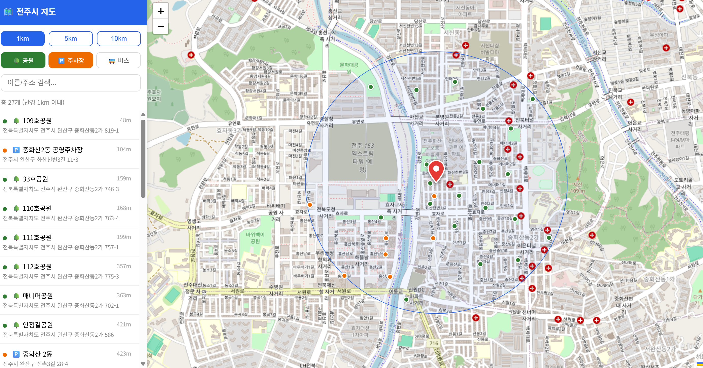

# 🗺️ 전주시 생활 편의시설 지도

전주시 공공데이터를 활용해 도시공원, 공영주차장, 버스정류장을 한 화면에서 탐색할 수 있는 인터랙티브 지도 웹 애플리케이션입니다.

---

## 📌 프로젝트 개요

공공데이터포털의 전주시 데이터를 전처리·정규화하고, Leaflet 기반의 지도 UI 위에 시각화했습니다.  
내 위치를 기준으로 반경 내 시설만 필터링하거나 이름·주소로 검색하는 등 실용적인 탐색 기능을 제공합니다.

| 항목 | 내용 |
|------|------|
| 개발 기간 | 2026.05 |
| 개발 형태 | 개인 프로젝트 |
| 역할 | 기획 · 데이터 전처리 · 백엔드 · 프론트엔드 전담 |

---

## 🖥️ 주요 기능

### 🗂️ 카테고리별 POI 표시
- **도시공원** 🌳, **공영주차장** 🅿️, **버스정류장** 🚌 각각 색상이 다른 마커로 구분 표시
- 카테고리 버튼을 눌러 토글 ON/OFF 가능

### 📍 내 위치 기반 반경 필터
- Geolocation API로 현재 위치를 자동 감지 (미지원 시 전주 시청 기본값)
- 1km / 5km / 10km 버튼으로 반경 전환 — 원형 반경 시각화와 함께 사이드바 목록이 실시간 갱신
- 내 위치 마커(빨간 핀)를 **드래그**하여 기준 위치를 자유롭게 변경 가능

### 🔍 검색 및 목록 탐색
- 이름 또는 주소 키워드로 실시간 검색 (한글 부분일치)
- 사이드바 목록에 각 시설까지의 거리 표시, 클릭 시 지도 포커스 및 팝업

---

## 🛠️ 기술 스택

| 구분 | 기술 |
|------|------|
| Frontend | HTML5, CSS3, Vanilla JavaScript, Leaflet.js |
| Backend | Python, FastAPI |
| Data | Pandas, OpenStreetMap Nominatim (지오코딩) |
| 데이터 출처 | 전북특별자치도 공공데이터포털 |

---

## 📁 프로젝트 구조

```
jeonju_map/
├── index.html       # 지도 UI (사이드바 + Leaflet 지도)
├── main.py          # FastAPI 서버 / 데이터 API
├── convert.py       # 공공데이터 전처리 · 인코딩 변환
└── data/
    ├── bus_stop_utf8.csv    # 버스정류장
    ├── park_utf8.csv        # 도시공원
    └── parking_utf8.csv     # 공영주차장
```


## ⚙️ 실행 방법

**1. 의존성 설치**
```bash
pip install fastapi uvicorn pandas
```

**2. (최초 1회) 공공데이터 CSV 전처리**  
원본 CSV 파일을 `data/` 폴더에 위치시킨 후 실행합니다.
```bash
python convert.py
```

**3. 서버 실행**
```bash
uvicorn main:app --reload
```

**4. 브라우저 접속**
http://localhost:8000
---

## 🔎 데이터 파이프라인

원본 공공데이터(CP949 / EUC-KR 등 다양한 인코딩)를 `convert.py`에서 자동 감지하여 UTF-8 CSV로 변환합니다.  
공영주차장 데이터의 경우 위경도 좌표가 누락되어 있어, **OSM Nominatim API**로 주소 지오코딩을 수행하며 결과는 로컬 캐시(`geocode_cache.json`)에 저장됩니다.

---

## 📸 스크린샷



---

## 🚀 배포

Railway를 통해 배포한 데모 사이트에서 직접 체험해볼 수 있습니다.

🔗 **Live Demo:** [web-production-de371.up.railway.app](https://web-production-de371.up.railway.app/)

---

## 📝 느낀 점 / 배운 점

- 인코딩이 불일치한 공공데이터를 안정적으로 처리하는 전처리 로직 설계 경험
- Leaflet의 커스텀 아이콘·드래그 이벤트 등 지도 라이브러리 심화 활용
- FastAPI와 Pandas를 조합한 경량 데이터 서버 구성
